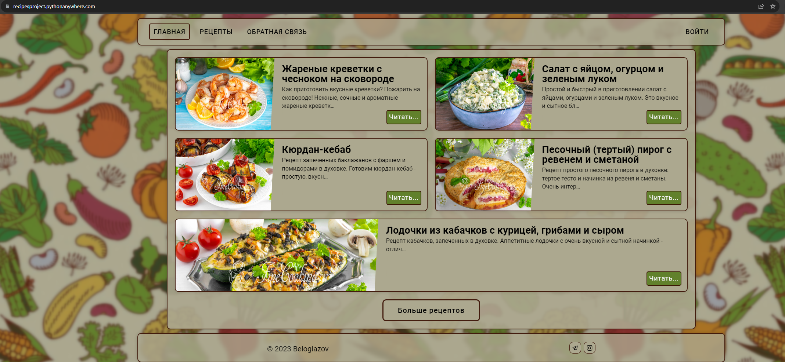

# Проект “Сайт рецептов” на Django
## Краткое описание задания:
### Используя фреймворк Django создайте сайт, на котором пользователи смогут добавлять свои рецепты блюд и просматривать рецепты других пользователей. Готовый проект необходимо сдать в виде ссылки на рабочий сайт в сети интернет и репозитория с исходным кодом проекта.

### [Нажмите здесь, чтобы перейти на сайт прокта](https://recipesproject.pythonanywhere.com)
